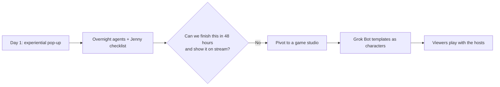
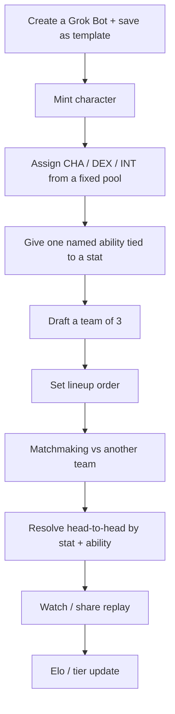
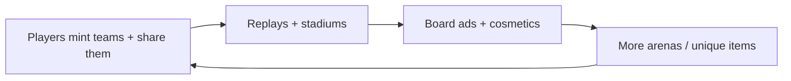
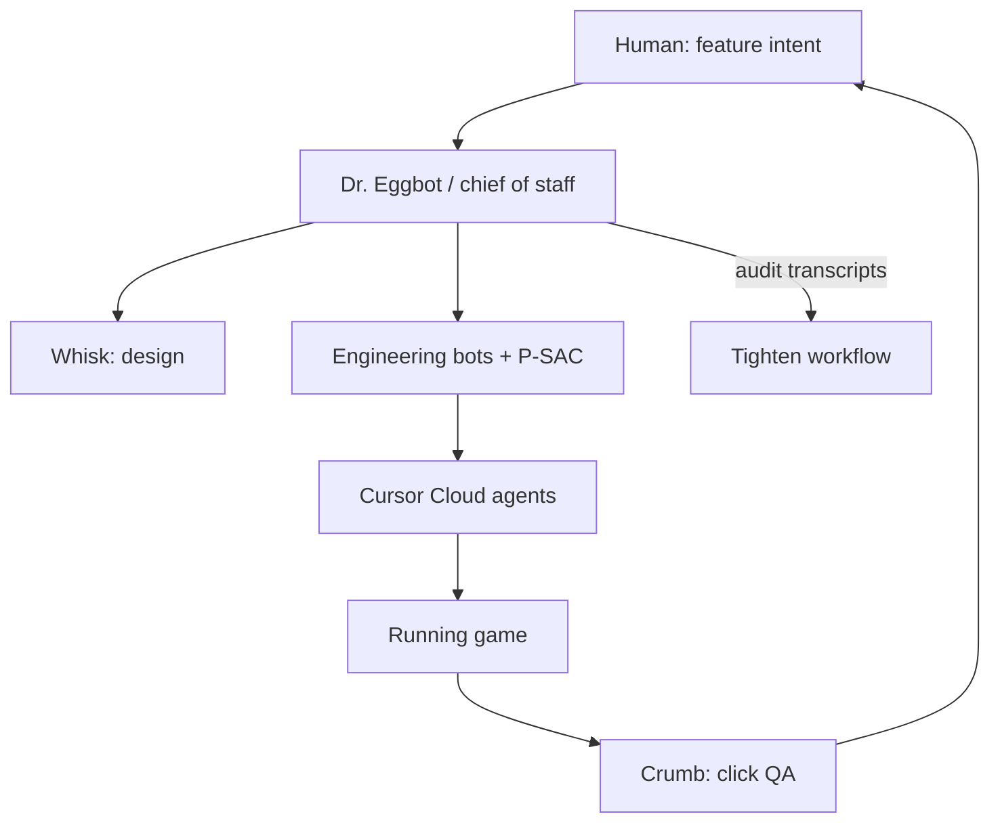

# Grok Bot Galaxy Livestream — Day 2 Detailed Notes

> **Event**: Grok Bot Galaxy live build, Day 2 of 3 (Dreamforce week, San Francisco)  
> **Source livestream**: [x.com/i/broadcasts/1PKqrNyvmYwGb](https://x.com/i/broadcasts/1PKqrNyvmYwGb)  
> **Event page**: [luma.com/3ifrgttw](https://luma.com/3ifrgttw)  
> **These notes are grounded only in the Day 2 named transcript.** Claims, bot names, numbers, and product behavior below come from what was said on stream.  
> **Day 1 companion**: `Grok_Bot_Galaxy_Day1_Livestream_Detailed_Notes.md`

---

## 0. How to read these notes

Day 2 is again two tracks, but the company track **pivots**.

| Track | What happened on Day 2 | Why it matters |
|---|---|---|
| **Live company** | Overnight agents + Jenny’s Day-1 advice killed the SF pop-up. They became a **game studio**. By close they had a running web app with X login, a leaderboard, and a factory of game bots. | Shows a real zero-to-one pivot, not a slide about pivoting |
| **Workshops + guests** | Sales engineers, sales, SDRs, customer support, plus Karen / Matt Berman / Shardul | Same product model as Day 1, now applied to GTM and support loops |

One sentence for the new company:

**Upload a Grok Bot template → mint it as a game character with stats + a named ability → draft a team of three → set a lineup → fight another player’s lineup.**

---

## 1. Recap of who is in the room

Same core trio as Day 1.

| Person | Day-2 job on the live build |
|---|---|
| **Matt Palmer** (DevEx; said “SpaceX” on the Day-2 intro) | Whiteboard, landing page, ads / Remotion, audio engineer bot (Strudel + Suno), X-login testing |
| **Lauren / Potato** | P-SAC (P Stack) planning playbook → types, signatures, verify checklists. Built the first playable UI. Engineering factory (Whisk, Crumb, Dr. Eggbot) |
| **Roshan** | Product / match flow, drag-to-reorder lineup, Elo / tier UX, “ship then iterate” |

Guests and workshop leads on Day 2:

| Person | Slot | Role they stated |
|---|---|---|
| **Amrita** | Grok Bot for **sales engineers** | Field engineer at Cursor |
| **Karen** | Studio guest | Creative technologist / filmmaker, ~3M followers, Grok Bot since early days |
| **Krista Letts** (“Crystal” in the transcript) | Grok Bot for **sales** | xAI GTM |
| **Mark Wright** | Same sales workshop | xAI GTM |
| **Matt Berman** | Studio guest | AI content creator (~3 years; 20 years in tech) |
| **Shardul** | Studio guest | Games / virality (Minecraft, Wordle-class puzzles, own project) |
| **Simon** | Grok Bot for **SDRs** | xAI / SpaceX GTM, SDR |
| **David** | Grok Bot for **customer support** | xAI software engineer, user-ops org |

Amrita’s Day-2 workshop menu (said at open): sales engineers now → sales later → SDRs → customer support, while the studio keeps building.

---

## 2. The overnight pivot — why the pop-up died

Day 1 ended with an experiential **SF pop-up** and Jenny’s permit / venue / catering checklist. Day 2 opened with the team saying they had **bitten off more than they could chew**.

Reasons they gave, grounded in the transcript:

| Reason | Who said it |
|---|---|
| SF licensing, restrictions, permits | Lauren, citing Day-1 guests |
| Not entertaining on a livestream (paperwork vs. pixels) | Lauren |
| Overnight agents came back with “you cannot finish this in two days” | Matt |
| Viewers should be able to **play along**, not just watch venue emails | Matt |
| Build something you are already passionate about / have done before | Roshan |

Roshan’s line they repeated:

> “The agents told us to pivot. So we’re pivoting.”

New business definition they used on the whiteboard:

- The **product** is a game.
- The **company** is a game studio.
- Distribution, support, ads, landing page, and ops are the same functions any company needs — they will run those with Grok Bots too.

---

## 3. What a Grok Bot template is (Lauren’s definition on Day 2)

A template is how you **share a bot with someone else**. It packages:

- Skills
- Routines
- **Selective memories** that have been generalized so they do not leak private context

Marketplace bots are public examples of the same format. The game’s hook is: take that shareable unit of expertise and **turn it into a playable character**.

---

## 4. Game design they white-boarded live

### 4.1 Core loop (MVP)

MVP sentence from Matt:

> Template → draft team → set lineup → compete against another lineup.

They explicitly wanted a **tight first version** with room to add arenas, stat upgrades, and new abilities later.

### 4.2 Team composition

| Slot | How you get it | Example on stream |
|---|---|---|
| 1 | You upload a template | Lauren’s **Dr. Eggbot** (she said it “has to be legendary”) |
| 2–3 | Drafted / seeded companions | **Outbound / prospecting bot**, other commons |

Early prototype: three **common** bots if you get unlucky on the roll. Lineup order matters (who fights first).

### 4.3 Stats

Inspiration: classic RPG trio.

| Stat | Shorthand on stream | Flavor they used for mapping a real bot |
|---|---|---|
| **Charisma** | CHA | Social / coordinating people. Outbound prospecting bot had **72 CHA** in one mock. Ability example: **Rizz** (Dr. Eggbot) |
| **Dexterity** | DEX (“decks” in the transcript) | Bot that connects to many services, “moving all around.” Ability example: **Hustle** (outbound bot — DEX-based even though CHA was high) |
| **Intelligence** | INT | Analysis / technical bots |

Ability names should be **flavorful**, not “charisma ability.” Lauren’s example from her own stack: Dr. Eggbot could surface a P-SAC skill like **Onslaught**.

### 4.4 Stat-pool math (as they designed it on the board)

They wanted minting to be **deterministic** from a given template (same bot → same base stats) so a character “persists,” with rarity as the only random booster.

**Common / base pool**

\[
CHA + DEX + INT = 100
\]

**Bounds they chose live**

- They did not want a zero stat.
- First proposal: minimum \(10\).
- They then dropped the floor to **\(1\)**.
- If two stats sit at the floor, the third max is:

\[
100 - 1 - 1 = 98
\]

So the legal region for a common mint is:

\[
CHA, DEX, INT \ge 1, \qquad CHA + DEX + INT = 100
\]

An LLM reads the bot description and **allocates the 100 points** (charismatic coordinator → CHA bias; many integrations → DEX bias). The allocation is still forced to sum to 100.

**Rarity multiplies the pool, not the win rule.** Matt’s sketch (exact numbers left open):

| Rarity | Total stat pool (sketch) | Intent |
|---|---|---|
| Base / common | \(100\) | Default mint |
| Rare | \(> 100\) | Small boost |
| Ultra | higher | Mid boost |
| Legendary | highest | Dr. Eggbot fantasy; they immediately worried “if everyone can mint legendary, everyone puts it in the main roster” |

Bug they hit in the first UI: the three numbers **did not add to 100**. Lauren treated that as a verify-checklist item from P-SAC and made the agent fix it. After reload, commons summed correctly.

### 4.5 Combat

- Lineup vs lineup, one pairing at a time (CHA ability vs INT ability, etc.).
- Abilities can roll a special boost at mint time (LLM-generated).
- Matchmaking is lightweight.
- Resolve can be **instant** under the hood; the UI should *play* the fight so humans can watch.
- First prototype resolved **too fast**. They queued animations, auto-advance rounds, and hide raw stat cards during the show (avatar only).
- After the match: optional replay link (Lauren: someone else can watch later — also a monetization surface).

### 4.6 Ranking

They started talking in **tiers + Elo**, not raw numbers in the hero UI.

| Idea | Detail from stream |
|---|---|
| Starting Elo | Both Matt and Lauren showed as **Gold at 1,000** after first X logins (leaderboard was buggy and did not list them) |
| Example band | Roshan: “Bronze is from 800 to 1,000” as a sketch, then you *speak* the tier name |
| After-match caption | “Diamond −10” / “Potato −5” next to the handle, not the full Elo integer |
| Severity | Arrows that get more severe as you drop |

### 4.7 Monetization — explicitly not pay-to-win

Lauren asked the business question on camera: if this is a real studio, how do you make money without making gamers hate you?

| They rejected | They liked |
|---|---|
| Pay to win | Cosmetics (“I’d pay a dollar for a cool hat,” Lauren) |
| Energy / limited daily turns that gate power | **Unique** items so your hat is yours (Grok Imagine APIs) |
| Paying for stronger stats | Paid access to **stadiums / battlegrounds** (map, not power) |
| | **Ads on the stadium boards** — classic sports model, does not change combat |
| | Replay / spectator links as an attention flywheel |

Matt’s growth rule for a zero-to-one studio: **care about users first, layer monetization after you feel the product.**

Distribution buckets they listed as “the rest of the company”:

- Landing page, SEO / AEO, ads
- Community via **X chat** as the support channel
- Email / even a phone number
- Hire a fourth teammate or intern (joke about seed funding)

---

## 5. How they actually built it on Day 2

### 5.1 Lauren’s engineering method

P-SAC / P Stack again. The planning playbook (she did not read it all on camera) includes:

- Verification checklists
- Pseudocode for **types and function signatures** (her default way of thinking)
- Later: a debug panel with caps (common cap, sliders)

**In-the-loop vs. autopilot** (important Day-2 lesson):

| Codebase maturity | How she uses bots |
|---|---|
| Grok Bot itself (mature, agent-friendly architecture) | She does architecture. She does **not** micromanage every agent. |
| This new game (zero-to-one) | She **wants** to watch mistakes, because the agents do not yet have a safe architecture |

Matt’s translation: early life-cycle = read the output or the agents wander.

**Cursor Design Mode** (shown live): open the app in the Cursor browser → Design Mode → click the broken slider → “this input is weird and doesn’t slide correctly, please fix.” The bot gets the exact element. That is how they stayed in flow instead of writing a pixel bug ticket.

Combat architecture note from Lauren (not a game-industry veteran, her words): graphics and game logic should not block each other. The match can resolve instantly; the client just *presents* rounds.

### 5.2 Mid-day playable prototype

What was on screen around 2:00–3:30:

- Seed bots, including Dr. Eggbot
- Reorder lineup (later: make the row **draggable**, kill the reorder button)
- Outbound prospecting first because 72 CHA (even though its ability **Hustle** is DEX)
- Debug sliders they called “worst possible UI,” then fixed
- “Finding match / looking for another agent player”
- Fight resolved too fast → queue animations
- Hide the detail card; show avatar only
- Auto-find a new match in ~5 seconds if the user does not click
- Show Elo delta as tier ± N

### 5.3 End-of-day product state (studio wrap ~08:10)

| Piece | Status when they signed off |
|---|---|
| Web app | Running. Backend hooked up |
| Auth | **Log in with X** works (`@Roshan_X` mentioned) |
| Leaderboard | Exists, **empty / wrong** — both hosts gold at 1,000, names missing |
| Import a bot | Intended: paste a template link (Dr. Eggbot). **Bugged** — Lauren could not add bots yet |
| Name of the game | Still unset. “Think of an actual good name tomorrow” |
| Deploy | Planned that night / Day 3 so chat can play |
| Ads marketplace | Matt’s MVP not rebased onto Lauren’s branch yet — Day-3 sprint |
| Music | Audio-engineer bot learned **Strudel**, then wrote **Suno** prompts. They previewed lobby, draft-room, and battle tracks live |

### 5.4 Bot factory they hired during Day 2

| Bot | Job | Note |
|---|---|---|
| **Whisk** | Game designer | New on Day 2 |
| **Crumb** | Play tester | Clicks through the live app looking for bugs. Not yet taught to give *design* feedback |
| Audio engineer | Lobby / battle / draft music | Strudel first (too chiptune / pixel). Suno second (battle track they liked; draft-room energy) |
| Ads / Remotion bot | Square / portrait / landscape ads from lander hero | Spawned via Dr. Eggbot → Cursor Cloud agent. Matt used 1:1 as the default for X |
| **Dr. Eggbot** | Meta-bot / factory + workflow auditor | Reads all bot transcripts, names bottlenecks |

Dr. Eggbot’s audit of Lauren’s factory (her words on stream):

- **Serial factory / human merge** is the bottleneck — agents wait on her to merge
- **Lauren is the interrupt bus** — she is still very in the loop, which she wants while prototyping
- Goal for Day 3: more autopilot so humans are **directors of features** (ask for X → engine builds, play-tests, QAs, guards regressions)

### 5.5 Viewer offer at close

- Duplicate / create a bot with **Dr. Eggbot**
- QR on stream
- **Free month of Grok Bot** — they called it **$200** of value
- **First 1,000** claimants, stream-only

---

## 6. Amrita — Grok Bot for sales engineers

### 6.1 Frame (same product, SE lens)

Task chat → team of colleagues that return **finished work**. Cloud + own computer + memory. Download on Android / iOS / Mac. Coasters on tables had QR templates.

New Day-2 twist she previewed: she would ask a bot **to hire its own team** (“if you had to staff yourself, who do you need?”). Bots spinning up bots = the multiplayer multiplier.

### 6.2 Her three SE bots

| Bot | Job | How it works on stream |
|---|---|---|
| **Mimi** | Customer proof-point / case-study slides | Owns a master deck. Template on every case slide: **problem → solution → impact → quote**. Given a blog post, she writes that slide, pulls the real logo from the brand site, screenshots, inserts into the deck. Live job: Salesforce post “cut legacy code coverage time by 85%.” Prior job: Jellyfish / Cursor code-review post |
| **Sherlock** | Technical expert who may speak to customers | Access to the **Flylo** booking repos (front + back). Uses **Cursor Cloud Agents** so Amrita can close the laptop. Example: two customers grabbing the last cabin / same seat. Answer he produced: protection is in **Postgres**; last cabin is held **10 minutes** from start of checkout; second booker gets a conflict. Steered never to leak IP and to phrase for a non-engineer |
| **Serena Williams** | Competitive intel | Named because Serena studies opponents. Drives competitor UIs on her own VM (Expedia / Skyscanner / Google Flights vs Flylo). Reads changelogs and tech blogs. Can ask Sherlock “do we even implement that race condition?” Routine idea: weekly Expedia/Skyscanner blog digest |

Flylo recap (demo company reused all day): toy airline / flight booking stack — public site, backend, internal crew app. Same universe David later used for support ($20/month inflight Wi-Fi SKU).

### 6.3 SE use cases she listed

- Customer security / architecture questions (“how is memory stored? is the computer a Linux VM?”) answered from repo + docs without leaking implementation
- Competitive product tours on the bot’s computer
- Pre-call deck curation from a giant master deck (she left live call-time curation to Krista’s **Echo**)

---

## 7. Krista Letts + Mark Wright — Grok Bot for sales

### 7.1 Mark’s maturity curve (sales version)

| Stage | Sales example he gave |
|---|---|
| Chat | Ask a question, get copy |
| Task copilot | “Clean up my files,” then wait for the next order |
| Delegated workstream | “Build me pipeline” / “get me a meeting with X” |
| Staff function | A team of bots on a book of opportunities, working together |

Why Grok Bot for sales, in his words: iMessage-shaped, own VM so the laptop can close, uses the same tools the rep uses, you state an **objective**, templates move a whole team faster. Krista had already shared templates internally at xAI.

Sales use cases on his slide:

- Pipeline generation (stop hunting contacts by hand)
- Engineering questions without pinging the SE every time
- **Echo** — live call → deck
- Chief of staff as the front door
- Forecasting as a routine instead of a spreadsheet ritual

### 7.2 Krista’s bot roster

| Bot | Job |
|---|---|
| **Olive** (named after her dog) | Chief of staff / day-to-day. Meeting prep on the bus. Draft-and-send email cards (customer asked for a one-pager). Inbox-scan routine **once or twice a day** — she cut frequency on purpose because more routines were noisy and wasteful with tokens |
| **PG** | Outbound prospecting / pipeline |
| **Echo** | After a discovery call: stop the **Granola** recording → bot updates slides with *that customer’s* use cases and next steps. Also: “translate this slide to Japanese” for international accounts |
| **Customer expert** | Strategic accounts. Usage before renewal, product-signal watch, noisy Slack threads, and a change-log loop: when xAI ships, pull feature requests from a month ago and email “we just shipped the thing you asked for” |
| Engineer-shaped bot | Same social rule as Slack-an-engineer / Slack-a-BDR — the bot goes and does that work |

Olive’s email card is the sales version of Amrita’s approval modal: draft, edit, send, or discard.

---

## 8. Simon — Grok Bot for SDRs

### 8.1 Maturity curve for an SDR

1. Chatbot: “rewrite this email,” then paste into Gmail.
2. Copilot + MCP: the AI **sends** the email.
3. Full job + staff: prospecting + sequencing + RevOps + AE context in one system.

He talks to **one** bot most of the day (chief of staff). Everyone else is downstream.

Templates matter more for SDRs than almost anyone else, in his telling: **what works at SpaceX/xAI today did not work three months ago.** Sharing a bot is how the team copies a working motion before it dies.

### 8.2 SDR use cases

| Motion | What the bots actually do |
|---|---|
| ICP from first principles | Look at AE deals that reached stage 1 / closed. Common title, industry, who is the economic buyer vs. the first meeting. Reverse-engineer from “how many S1s can I get?” |
| Prospecting | Enrichment tools + web search (job posts, funding) |
| Sequencer | Living prospect list (CSV today) updated by routines. When an AE had a call yesterday, that transcript **rewrites today’s outbound** (tool fatigue, named Champion, etc.) instead of dying in Gong |
| Account research | PLG power users internally + external signals (fundraise, hiring) + “this new product changes the pitch for fintech” |
| Copy | Sync Gmail. Filter to **external** mail on accounts where he is the assigned SDR. Keep only threads with **positive replies**. **Heavier weight on recent wins** because the offering changes |

### 8.3 His staff

| Bot | Color / role in his UI |
|---|---|
| **Simon Bot** | Chief of staff. All other bots are created *through* him so he knows their purpose |
| **Shakespeare** | Outbound voice, trained on winning mail |
| **Web search** | Research; delegates to an army of **Simon Soldiers** (50–100 accounts in parallel) |
| **Customer Bot** | Meeting + Closed-Won context by vertical (fintech example) |
| Army huddle | Web search + soldiers in one room |

Color coding is how he reads the chief of staff’s DMs at a glance (orange = research mission, Shakespeare thread = copy, green = soldiers on accounts).

Daily routines: wake up to an already-assigned work list. Same “always on / coffee walk from the phone” story as the other GTM talks.

Teach-by-recording: for SDR tools with no API, he records the browser workflow once so the VM can repeat it.

---

## 9. David — Grok Bot for customer support

David: software engineer in xAI **user ops**. Demo-heavy session on the Flylo toy airline.

### 9.1 Why it feels like a coworker (his three reasons)

1. **Always on** — own computer, laptop can close. Routines = cron or event triggers, created in conversation (“create a routine at this time / on this event”).
2. **Easy** — messenger UI; you do not need an IDE.
3. **Fits real tools** — marketplace connectors for Plane / Zendesk / Intercom, Slack, Notion. If a connector is missing, kick a **cloud agent** and build it. Do not wait on a vendor roadmap.

### 9.2 Support use cases

| Use case | Crawl → walk → run |
|---|---|
| Answer tickets | Read + summarize + name the root issue → draft a note on the ticket → send when you trust it |
| Alerting | Routine every hour: classify “6+ month customer threatening churn” → Slack the team |
| Internal Q&A | Same knowledge base, but for GTM / TSE questions (today’s cloud-agent release, refund SOP history). Public docs ≠ internal SOP |
| Self-improve | Read last week’s traces; find tickets that should have been flagged earlier; patch the system |

### 9.3 Four-bot demo team (he said do **not** start here)

| Bot | Job |
|---|---|
| **Build** | Setup + infrastructure |
| **Reply** | Answers users in **Plane** and Slack |
| **Alert** | Pinged by Reply; posts Slack + tags David |
| **Tune** | Improves the system from traces |

Start with one generic bot and one workflow. Split only when you need two things at once.

### 9.4 Knowledge base (Notion, Flylo)

| Layer | Contents | Who may see it |
|---|---|---|
| Public docs / FAQ | Auth, billing, product. Google-able | Customers |
| Internal SOP | Refund rule (below) | Billing humans + bots, **not** the public reply |
| Reply process | Read ticket → consult KB → reply **or** hand off → act → leave a note | The agent |

**Refund SOP used on stage**

- SKU: inflight Wi-Fi pass, **$20 / month**
- “Today” in the demo: **September 16**
- **Carter**: just subscribed, renews in a month → **approve, cancel, Stripe refund**
- **Damon**: ~20 days in, renews in ~10 days → **deny**. Offer scheduled cancel at period end so he is not billed again. Do **not** paste the 14-day rule into the customer-visible reply

Formal rule:

\[
\text{days subscribed} \le 14 \Rightarrow \text{refund + cancel}
\]

\[
\text{days subscribed} > 14 \Rightarrow \text{deny refund (optional end-of-term cancel)}
\]

### 9.5 Tickets he ran live

| Ticket | Result |
|---|---|
| Alex — forgot password | High confidence. Quoted the public auth doc **verbatim**. Left a thinking trace (root issue + source) |
| Ben — SSO / Okta, not in KB | Low confidence, **hand off**. Alert bot fired Slack because it looked like an enterprise lockout |
| Carter + Damon — refunds | Stripe actions with optional approval. Carter: subscription **active → canceled**, payment refunded. Damon: status unchanged |
| Elena — share Wi-Fi pass? | Missing from FAQ. Reply asked **Tune** to add it. David approved: “not allowed for simultaneous use” (written in green). Second pass: high confidence + link to the new FAQ section |

Internal Slack test: billing teammate asks “what is the refund SOP?” → bot posts the **internal** rule (after “always allow” for Slack).

### 9.6 Guardrails and evals (Q&A)

- Start **read-only**, then writes with manual approval, then scoped permissions per bot (one may post to Slack unattended, another may not).
- Every Reply run writes a **trace** to Postgres via **Supabase**: duration, files consulted, files used to answer — even on dry runs / internal notes.
- Separate **eval** table for the suite you re-run after every change.
- Tune reads those tables.
- Token cost he measured:
  - Medium / complex ticket: about **$1–$2**
  - After half a day of work, low-complexity billing tickets **batched by script**: about **$0.20**
  - Other support agents often charge **$1–$10 per resolution**; humans cost more
- Bulk is cheaper than “reply to Alex” (that forces a fuzzy search of all open tickets). Pass **ticket IDs**.
- Multi-bot debug = traces, not vibes.
- Phone support: he has not done much; pointed at Matt’s X video of a bot with a phone number making a reservation.
- Non-technical teammates writing to prod: share a **restricted template**. Prefer GitHub as the KB so updates are PRs, Bugbot review, code owners, evals on the **branch** before merge.
- First thing a new support team should automate: the **20% of issue types that are 80% of volume**, with SOPs + evals, then put the bot in front.

---

## 10. Studio guests

### 10.1 Karen — newspaper that prints while you sleep

Creative technologist / filmmaker. Early Grok Bot user. Not “super technical.” Cursor used to make her feel dumb looking at a wall of code. Grok Bot **hides what she does not need** and still kicks Cursor agents on the back end.

**Bot style:** uncreative names, one bot per task. She does have a chief of staff. Also: package tracker, reality-TV tracker, and **~30 morning-newspaper bots** from template testing.

**Personalized newspaper** (she brought that morning’s print to the studio):

| Section | Source |
|---|---|
| Day summary + meetings | Calendar + email |
| Packages arriving | Package tracker |
| Weather | Live |
| Reading section | Subscriptions / Substacks she **picks** during setup; verbatim + editor summary so the paper is not 20 pages |
| Comic | Drawn from *today* (hers was the Uber to this event → Grok Bot Galaxy → leaving) |
| Crossword | Clues from her life |
| Avatar | Setup asks glasses / outfit so the comic looks like her |

Template URL she gave on stream: **newspaper.karenx.com**. Setup = a **~30-page prompt** split into (1) onboarding questions and (2) rules. Point: a template is a product, not a one-liner.

She also mentioned **Vesta boards** as another physical build (on the slide; they started with the newspaper).

### 10.2 Matt Berman — do not automate taste

AI creator. Friends with the Grok Bot team; has done pop-ups with them.

Split he has landed on in the last year, and especially the last **three weeks**:

| Automate | Do not automate |
|---|---|
| Sponsor ops, meeting notes, follow-ups, proposals — “back office” | The idea and the story. “Don’t use AI for the actual creative process” when you are deciding *what* to make |
| Editors Brian + Alex now dictating **parallel** video edits (impossible for them ~3 weeks earlier, he said) | Human craft of a compelling story — he thinks that skill **gains** value |

**Family bot** (the one he uses most):

- Two kids, two schools, multiple sports
- Teachers / coaches send “three-page emails every other day”
- Bot reads everything, keeps only family-related mail
- **1–2 sentence** summary
- Marks whether he must **act** (“tell the coach yes/no”) vs. merely know
- Writes events onto a shared family calendar with his wife
- Flags conflicts and helps resolve them

His point, which Matt Palmer echoed: the glue between two calendars and five inboxes used to be a tired human.

### 10.3 Shardul — how a tiny game spreads

Plays Minecraft, daily puzzles (Wordle-class), and his own project.

Virality, in his words:

1. Word of mouth once a base exists
2. **Constant posting** — one viral post, even at a low conversion rate, seeds the community. He sketched “hopefully 10%, probably much less”

Where to show up:

| Channel | His take |
|---|---|
| Instagram | Would **not** recommend for this kind of game (wrong niche) |
| X | Best first home — engineers / early adopters |
| Niche Reddit | Small rooms, ask for **feedback**, not ads; players follow |
| LinkedIn / TikTok | Fine if TikTok hooks in the **first 2–3 seconds** |

Matt’s follow-through on stream: generate **Remotion** ad variants from the lander (code as source of truth, not a random video model), starting at **1:1** for X, plus portrait and landscape. Dr. Eggbot onboarded a Remotion ads bot and kicked a cloud agent.

---

## 11. Cross-cutting lessons that only showed up clearly on Day 2

| Lesson | Evidence on stream |
|---|---|
| Agents can **force a pivot** if you give them the constraints (time, city law, “must be fun on camera”) | Pop-up → game studio overnight |
| Zero-to-one still needs a human in the merge queue | Dr. Eggbot: “Lauren is the interrupt bus” |
| Mature repos can run more unsupervised than greenfield | Lauren on Grok Bot vs. this game |
| Design Mode > bug tickets for UI | Broken slider fixed by clicking the element |
| Combat can be instant; presentation is the product | First fight “happened too fast” |
| Do not paywall power | Cosmetics / stadiums / ads |
| Support should crawl | Notes → drafts → Stripe refunds |
| GTM copy should weight **recent** wins | Simon, because the product changes every quarter |
| Templates are how a team time-travels | Krista shared sales templates; Karen shipped a 30-page newspaper template; contest = share a template |
| Physical artifacts still punch above software | Karen’s printed paper; Day-1 pop-up instinct reused as “stadium + hat” |

---

## 12. Day 2 → Day 3 open list (their words)

1. Fix import-by-template-link and the leaderboard.
2. Deploy so chat can play.
3. Name the game.
4. Animations, auto-next-match, Elo captions.
5. Rebase ads marketplace onto Lauren’s branch.
6. Teach Crumb to give design feedback, not only click bugs.
7. Move the factory toward autopilot so Day 3 is feature direction, not merge babysitting.
8. Make it go viral in one day — Shardul’s X + niche Reddit + Remotion loop.

---

## 13. One-page cheat sheet

**Company after Day 2:** a game studio whose first game turns Grok Bot templates into RPG characters.

**Combat math they froze:** three stats, common pool \(100\), each stat \(\ge 1\), rarity can raise the pool, abilities are named and stat-tied, teams of three, lineup order matters.

**Money they will not take:** pay-to-win. **Money they will take:** hats, unique Imagine items, stadium skins, board ads, maybe replay attention.

**GTM pattern across Amrita / Krista / Simon:** one front-door bot (Olive / Simon Bot / Sherlock+Mimi+Serena as a specialist set), computer-use where APIs end, Granola/Echo for calls, change-log nostalgia for renewals, recent-winning-mail as the style guide.

**Support pattern from David:** public FAQ ≠ internal SOP, hand off when confidence is low, alert the scary tickets, Tune writes the missing FAQ *after a human says yes*, traces in Postgres, start with the 80/20 ticket types.

**Factory pattern from Lauren:** P-SAC plan → types first → Design Mode for UI → Crumb clicks prod → Dr. Eggbot audits the humans.
