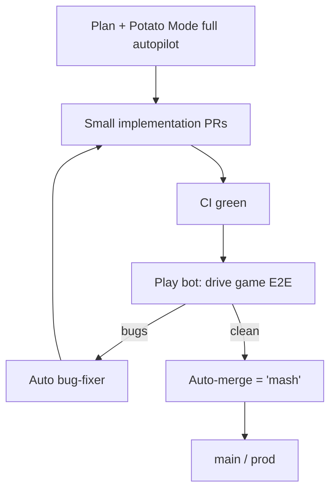
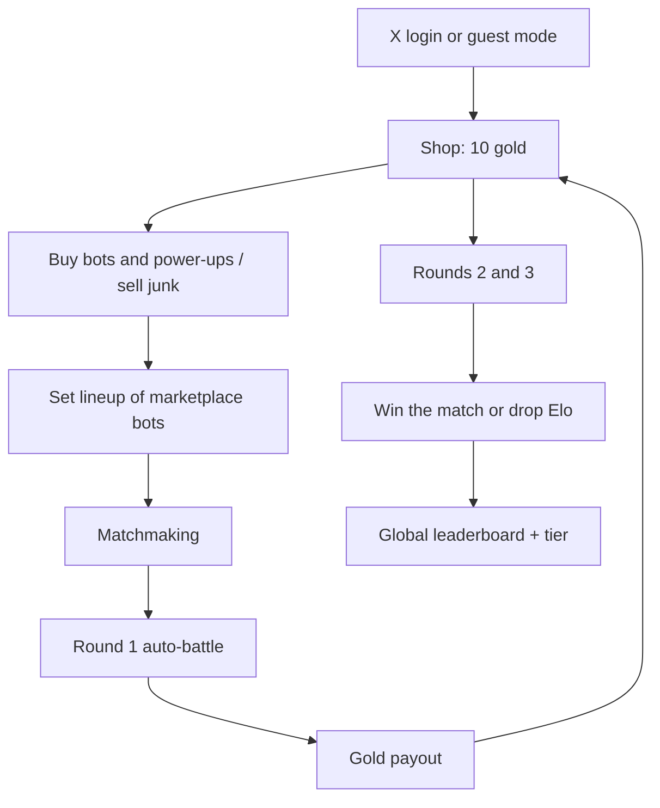
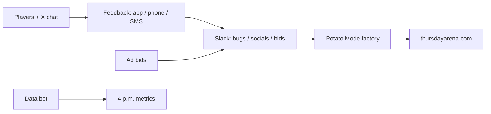
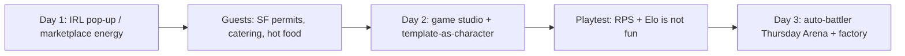

# Grok Bot Galaxy Livestream — Day 3 Detailed Notes

> **Event**: Grok Bot Galaxy live build, Day 3 of 3 — **launch day**  
> **Title on the replay**: Building a company in 3 days — launching today  
> **Source livestream**: [x.com/i/broadcasts/1YGNrbXEeazGw](https://x.com/i/broadcasts/1YGNrbXEeazGw)  
> **Event page**: [luma.com/3ifrgttw](https://luma.com/3ifrgttw)  
> **These notes are grounded only in the Day 3 named transcript.** Numbers, URLs, bot names, and mechanics below are what was said or shown on stream.  
> **Companions**: `Grok_Bot_Galaxy_Day1_Livestream_Detailed_Notes.md`, `Grok_Bot_Galaxy_Day2_Livestream_Detailed_Notes.md`

---

## 0. How to read these notes

Day 3 is the day they **ship**.

| Track | What happened | Why it matters |
|---|---|---|
| **Live company** | Overnight **Potato Mode / full autopilot** factory. Game retuned from “Elo rock-paper-scissors” into a **browser auto-battler**. Public launch as **Thursday Arena**. Ads, feedback loops, SEO, a prod outage, first theoretical sponsorship dollar. | The 72-hour experiment actually produces a URL and traffic |
| **Workshops + guests** | MarOps / RevOps, Customer Success / post-sales, Growth (Vincent), Stripe Link (Dan Hill), Marketing (Josh Kim), plus Eric on the floor to finish the product | Same teammate model, now used to *launch and grow* something |

One sentence for the shipped product:

**Thursday Arena is a free browser auto-battler whose roster is real Grok Bot marketplace bots. You spend gold in a shop, set a lineup, and fight three rounds.**

---

## 1. Who is on stream

Same core trio.

| Person | Day-3 job |
|---|---|
| **Matt Palmer** | DevEx at xAI. UI polish, X-login firefighting, ads / bid UI, audio + 3D stretch goals |
| **Lauren / Potato** | Factory owner. P Stack **Potato Mode**. Backend, security, load tests, UI feel. Chief of staff **Steve** |
| **Roshan** | Product, growth playbook with Vincent, SEO / AEO, metrics bot, Slack ops channels, mash/merge factory |

Guests and workshop leads named on Day 3:

| Person | Slot | What they stated |
|---|---|---|
| **MarOps / RevOps speaker** (labeled Matt Palmer in the transcript after the 9:00 a.m. PT stage cut — diarization is messy here) | Grok Bot for **marketing operations** | xAI RevOps / MarOps. Radiohead-themed bots |
| **Kyle Day** | Short stage clip | SVP Product & Engineering, Nokia product-development division |
| **Vincent** | Studio guest | xAI **growth** team |
| **Blake** | Grok Bot for **Customer Success / post-sales** + studio ads help | xAI AI deployment manager |
| **Dan Hill** | Studio guest | Stripe, **Link**. Handle referenced as **Dan Hill Tech** |
| **Josh Kim** | Grok Bot for **marketing** | xAI marketing |
| **Eric** | Studio closer | xAI, “a little bit of everything” — came to help **finish and ship** |

On-screen production gag: live agenda + the team’s bots (Steve, Bake, Cupcake Ange). Matt renamed his chief of staff from “chief of staff” → **Steve** → **Steven** after roasting Matt Berman for the same name. Lauren already had **Steve**. Roshan’s bot: **Bake**. Matt’s game bot: **Cupcake Ange**.

---

## 2. Morning promo — free month of Grok Bot

Valid at open for **new accounts only**, with a countdown on screen (~10 minutes).

| Step they required | Detail |
|---|---|
| 1 | Download Grok Bot |
| 2 | Create an account |
| 3 | Set up a **recurring task / routine** |

Examples Potato would tweet: scan email, watch GitHub issues, watch Slack.

Value they quoted: **one free month of the highest tier**, about **$200** of usage.

Lauren later floated giving more **Ultra** seats to **top of the Thursday Arena leaderboard** after launch (not confirmed on stream).

Near close they also ran a short “type **credits** in the X livestream chat” drop; production waved them off because that window had just ended.

---

## 3. The software factory (the actual Day-3 engineering story)

Lauren does not love the word “factory.” It is the closest analogy they had for **closed feedback loops** so agents can work without a human click-through.

### 3.1 Potato Mode

P Stack (Cursor plugin + Grok Bot plugin) includes a skill called **Potato Mode**.

Magic words they repeated:

> `/potato mode` + **full autopilot this plan**

What that does, in their words:

1. Breaks a plan into small phases.
2. Stands up a mini factory:
   - implementers open **small PRs**
   - verifiers **run the app**, fuzz it, click around, find bugs
3. Because verification is strict, PRs can **auto-merge**.
4. Overnight they landed **100+ PRs**, then on-camera counts of **145 → 160 → ~170**.

Matt had just merged **PR 124**, a UI rewrite that had been rebased several times.

Roshan later enabled an auto bug-fixer in **Lauren’s YOLO / Potato Mode**. His line: merges were “just merging and disappearing.” Lauren: you have to say the autopilot words or it will not go that hard.

### 3.2 Play — the QA bot

They no longer had yesterday’s human intern. **Play** is the QA stand-in.

| Trigger | What Play does |
|---|---|
| Recurring task / event: new PR | If CI is green, jump in |
| Computer use | Drive the **entire game** end to end |
| Output | Feedback before merge — it “knows how the game engine works” |

This is the same primitive as “check my email every morning.” The company lesson they drew:

> Isolate a human workflow. Give the agent the context that used to live in a person’s head. Automate the part an agent should own (spam, unsubscribe, first draft, click-test). Keep the part a human should own (send the sensitive mail, decide the feature).

### 3.3 “Mash” instead of merge

Dr. Eggbot was told to invent **potato-themed** task names. One Notion task that leaked into the factory:

> Every merged PR should be called a **mash**.

By afternoon Roshan’s chief of staff only believed in mashing. On the Git graph: pushes and **mashes**. Lauren: “mash PRs and squash potatoes.”

### 3.4 What the factory actually changed overnight

From their morning recap, not a changelog dump:

- UI rewrite / rebase
- Backend upgrade
- Security pass
- Load-bearing work so they “hope” it survives launch
- Guest mode (play before X login)
- Shop + gold + three-round auto-battle (see §4)
- ~70 marketplace bots with generated avatars
- Later in the day: win/loss ratio fixes, Elo suspicion, feedback ingestion, ad slots, `rules.md` + LLM text so the site is **agent-friendly**, SEO

Human jobs they kept for the 9:00 a.m. PT hour off-camera:

| Who | Focus |
|---|---|
| Matt | UI polish, scrolling / clipping / CSS |
| Lauren | Load tests + more UI (she gets “nerd sniped” by feel) |
| Roshan / Matt | User-feedback loop: collect, store, surface, implement |

Stretch goals they named and mostly did **not** finish before first traffic: Suno music from the audio bot, 3D character prototyping.

---

## 4. The game they launched

### 4.1 Names

| Name | Role |
|---|---|
| **Cupcake** | Internal code name on the morning build |
| **Thursday Arena** | Public name. Site: **thursdayarena.com** (one pass in the transcript also says `thirstyarena.com` — treat that as a slurred/typo; they also said “Thursday Space Arena”) |
| Org leftover | Still the Ship-by-Thursday energy from Day 1 |

Google: they claimed **#1** for “Thursday Arena” and liked the phrase **“free browser auto battler”** as the SEO line. Roshan: Cursor / a bot did the SEO. `rules.md` + LLM-readable text on the site so other agents can play too.

### 4.2 How the design moved (this is the important product lesson)

Day 2 whiteboard = CHA / DEX / INT pool of 100, abilities like Rizz / Hustle, 1v1 lineup, cosmetics, extra arenas.

They **played it** and said it felt like **rock-paper-scissors plus Elo**. Not fun.

Overnight they stole structure from auto-battlers they actually enjoy.

| Kept | Cut (“unship”) |
|---|---|
| Marketplace bots as the roster (~70+) | Complicated three-stat blocks as the *feel* of combat |
| Lineup order matters | Separate battlefields / arenas (for v1) |
| Leaderboard + tiers (incl. Platinum / Diamond) | Cosmetics as a launch pillar |
| Ads in the stadium / leaderboard | Pay-to-win |
| Tight core loop | The RPS-shaped 1v1 |

Roshan’s later reflection: abundance of AI makes **restraint** a skill. Internally they ask “what will we unship?” Feature-blast products are easy now and usually bad.

### 4.3 Loop that shipped

Combat vocabulary on Day 3 (different from Day 2’s CHA/DEX/INT talk):

| Piece | What they showed |
|---|---|
| Stats | **Attack** and **health** on the card |
| Ability example | On faint, give the two friends behind **+1 / +1** → you put that unit **first** so the buff lands |
| Another | On game start, deal 1 (cut off mid-sentence on stream) |
| Economy | **10 gold** to start. They wanted to rename gold → **tokens** so it does not collide with LLM-token talk |
| Win condition | Last through **three rounds** |
| Art | Cute cards, avatars generated per marketplace bot. A live PR was thickening art to fill the card |

Auth: **Sign in with X** plus **guest mode** from the night before. At the 9:00 a.m. PT cut, Matt’s X login was **down**; Lauren’s account still worked. That became the first fire of launch morning.

Leaderboard at open: basically Potato and Matt from playtesting. Mid-day with Vincent: “almost a thousand users on the leaderboard.” Later: Platinum list with **nine** people, then **three Diamond** players. **Ari the monk** led most of the afternoon. Hosts were bad at their own game (Roshan ~**82nd**, “bottom 5%”). They spun a bot: “read this and learn how to win.”

---

## 5. Launch-day business systems

They treated “we have a URL” as the start of a real studio checklist.

| System | What they stood up |
|---|---|
| Feedback | In-app + **phone** + **text**. Goal: feature requests into the same factory |
| Slack rooms | marketing, socials, metrics, bug reports, **ad bids** |
| Ads | Billboard slot + **leaderboard “take the top spot” bid**. Preview was “very vibe coded.” Needed SVG logo. First live bid = theoretical sponsorship — **moderation of user content was broken**, so they did not count real dollars |
| SEO / AEO | Agent-readable site, first Google result for the name |
| Growth playbook | Vincent bot writing Notion notes from a live interview (see §7) |
| Data bot | Pulled 4 p.m. Thursday metrics on camera |
| Prod | Lauren’s factory shipped a **bad SQL query** and took prod down while they were celebrating signups. “Classic.” They gave **Eric** GitHub push so he could land handwritten fixes. Prod came back before sign-off |

### 5.1 Scoreboard they read at ~4:00 p.m. Thursday

Numbers from the on-stream data bot, not an official blog:

| Metric | Number they said |
|---|---|
| Games / public matches | Crossed **4,000**, then **6,000+** public matches. Recap bot independently said **4.5k games** after looking the stream up on X |
| Users | Hoping to cross **2,000** before wrap; prod died mid-sentence so they were not sure they would hit it in the next few minutes |
| Site | Close to **30,000 page views** |
| Search | **#1** on Google for Thursday Arena |
| Diamond | **3** diamond players when they checked |
| Money | **$0** real. “Theoretical leadership dollars and theoretical sponsorship dollars.” Roshan: the “make a billion dollars” agent from the morning still had **zero dollars** |

---

## 6. Workshop — Grok Bot for RevOps / MarOps

Stage talk right after the 9:00 a.m. PT cut. Speaker is on xAI RevOps / MarOps (transcript attributes many lines to Matt Palmer). Audience: GTM engineering, systems, workflows.

### 6.1 The one-liner that is new vs. Days 1–2

> In these jobs you used to publish **rules**. Now you can publish **tools**.

Campaign setup checklists become internal apps that **already enforce** the checklist. Marketing and sales “play a game the ops team designed.”

Always-on + computer + connectors = you can close the laptop. Same product pitch as every other Galaxy talk, aimed at people who live in Salesforce + the warehouse + Slack.

### 6.2 Radiohead / music-gear bot roster

| Bot | Job |
|---|---|
| **OP-1** | Synthesizer → **chief of staff**. Turns inbox soup into tasks and delegates |
| **Fisher** | Receiver across email, calendar, SMS, Slack. Scheduled sweep of “what is new” |
| **Juno** | PM bot. Corner cases and PRDs for internal tools the GTM org will actually use |
| **Owned** | Engineer bot. CRM, warehouse, existing internal-tool codebase at xAI |

(The names are music-gear jokes. Speaker asked if anyone in the room was a Radiohead fan.)

### 6.3 Self-completing task list

1. Fisher’s routine fires (example: **9:04 a.m.** during the talk).
2. Fisher messages OP-1: here is what showed up in every inbox.
3. OP-1 splits **FYI** from **actionable**, reads the whole Slack thread when the ask is implicit.
4. Example task: **territory dispute** — two AEs arguing over an account. OP-1 relays that to the bot that owns CRM / assignment rather than dumping it on the human.

Unlock they claimed: you can mute Slack and email and still trust that only real work reaches you.

---

## 7. Vincent — growth, live-applied to Thursday Arena

Vincent is on xAI growth. Definition he gave:

| Motion | What “growth” looks like |
|---|---|
| **PLG** (their world, and this game) | Watch in-product struggle, put a nudge where the user is stuck |
| Sales-led | Mass outbound / LinkedIn — a whole industry exists just for that |

Roshan walked the **full funnel** on camera and hired a bot named **Vincent** on the spot to log a Notion growth playbook.

Ideas that landed in the playbook (grounded in the conversation):

| Idea | Why |
|---|---|
| Share popup the moment you land on / move on the **leaderboard** | Arcade-cabinet energy: brag your rank + X handle |
| After a match, one-tap **post to X** | Loop the livestream audience back into acquisition |
| Marketplace plug inside the game | Roster *is* marketplace bots; BYO-bot later |
| DM everyone who follows the studio on X and tell them to play | Standard playbook, cheap because the stream already exists |
| Partner with game hosts / discovery lists | Get featured where players already browse |
| Leaderboard as a growth surface, not only a scoreboard | Vincent’s first instinct looking at the UI |

He called ~1,000 leaderboard users “insane” for a game that had just become real.

Kyle Day (Nokia) in a short clip before/around this block: they want **persona-specific agents** next to every human seat, which only works if they can iterate those agents the way this stream iterates bots.

---

## 8. Blake — Customer Success / post-sales (+ ads ICP for the game)

Blake: AI deployment manager at xAI. Session title on stage: **Grok Bot for post-sales** (anything customer-facing **after** the contract). Maturity curve: chat → copilots → bots → **teams of bots**. Same iMessage / own-VM / 24-7 pitch (he apologized to Android users for copying iMessage).

On the studio couch he helped them treat **ad inventory** like a CS / GTM problem:

- Chief of staff / Dr. Eggbot gets a brief of what Thursday Arena *is*
- Skill in memory: ICP / personas / segments / scoring
- First-principles buyers for an ad slot in front of a highly engaged livestream + player crowd: indie studios, casual games, discovery platforms, snack / energy-drink brands, **merch**
- Matt: “we can make Thursday Arena merch”
- Draft outreach that cites **specific advertiser facts** the bot can see, then drop it in a sequence (he mentioned an “Apple Market sequence” in passing)

That is how the afternoon billboard + leaderboard bid UI got a reason to exist.

---

## 9. Dan Hill — Stripe Link and agent payments

Dan works on **Link** at Stripe. Grok Bot already has a Link connector (plus other Stripe connectors).

### 9.1 What Link is on this product

- Agent needs to buy something on the open internet.
- Link issues a **one-time card**.
- Grok Bot UI: **you approve the spend** (“$10 for this tree texture pack”) → agent checks out.

Dan has been making games with Grok Bot for weeks; the loop kept dying on “I need a texture pack / trees.” Same pattern as infra: domain, email, host, AWS.

### 9.2 Two buyer personas he sees

| Persona | Example |
|---|---|
| Busy human | Parking ticket, restaurant, flight, kid’s-school bill. Grok reads the inbox and just **goes and pays**. Matt pulled a parking-ticket clip he loves |
| Solopreneur / this studio | 17 half-baked home projects. Provision the stack instead of pasting a card into ten dashboards |

Day-1 pain they admitted: Matt spent an hour logging into ~10 services by hand.

**Stripe Projects** (`projects.dev` in his telling): connect Stripe once, then provision partner infra (DB, email, host, domain) from the agent. Native integrations listed on that page.

Dan’s side projects mentioned on the way out: infinite-scroll **Three.js** world; a “date-night spots” agent that produces a daily feed of restaurants he does not already know. Handle on screen: **Dan Hill Tech**.

---

## 10. Josh Kim — Grok Bot for marketing

xAI marketing. Run of show: what Bot is, how they use it internally to market/grow products, how a team starts.

### 10.1 Thought partner vs. doing partner

| Mode | What you get |
|---|---|
| Chatbot | Spar on strategy, edit copy. Thought partner, not a closer |
| Copilot / generic agent | Can start tasks; you still babysit complex ones |
| Grok Bot | Always-on **asynchronous teammates** that finish work **the way you do it**. Staff a **function**, not a prompt |

Create **one bot per job**. Message them like Slack/Teams. They message each other in group chats. Memory compounds with feedback. Own computer = teach **your** bidding quirks, **your** brief format, **your** file hygiene. Cloud = scheduled reporting without a Mac Mini. iMessage-shaped UI is the point for non-engineering marketers.

### 10.2 Demo promise (end-to-end campaign)

He said they would run a campaign from zero:

1. Market research
2. Positioning / betting on a line
3. Update a landing page
4. Build and monitor ads
5. Read the results
6. Turn the working pieces into **automation**

Plus a marketplace QR: copy the best internal templates instead of starting from a blank bot. Same “templates compound” idea as every other day, now aimed at marketers.

---

## 11. Eric, the last hours, and the 3-day recap

Eric (xAI, generalist) walked into the studio to **finish the product**. “It’s Thursday.” He needed repo write access; “Eric has to make PRs, the rest of us don’t” — then they granted push. That is the handwritten-code escape hatch when the factory ships a bad query.

### 11.1 Recap bot vs. human recap

Lauren asked a bot to look them up on **X**, not to use her notes. It drew on **TL Draw**. Quality of drawings: “not that great.” Quality of narrative: usable.

Three-day arc the bot (and then the humans) agreed on:

Roshan’s slide-style recap at close:

- Started wanting a **marketplace for templates** to do something joyful
- Auto-battler concept + a pile of monetization ideas
- Kept **ads**, dropped **cosmetics**
- Dropped the RPS mechanic
- The last 24 hours were defined by the **factory**: chiefs looping other bots, playtesting, auto-approving after fixes, landing to main (**mash**)

### 11.2 What they think they learned (their words)

**Roshan**

1. Speed appeared the moment they **aligned and shipped an MVP**. Deliberating the idea was the slow part.
2. They had unfair **distribution** (the stream). “Would anyone have played this if we were not live? I do not think so.” Getting people to **care** is still the hard problem.
3. Big-company Grok Bot talks **did** generalize: RevOps growth playbook, partnerships, one human wearing sales + partnerships + RevOps at zero-to-one.
4. Do not prompt a model to “make a billion dollars.” Build around something you **already know how to do**. Jenny’s pop-up checklist is the exhibit: they did not know permits because they had never done events.
5. For the gaps, **hire bots as employees** and let them take courses / study the best games. Varied team > one god-bot.

**Lauren**

1. Discover problems as a human. Once the motion is real, **freeze it into a bot** and let it run.
2. Workflow > splashy launch. Flywheels, then the next game.
3. **Restraint.** AI can build a million features. Discipline is the scarce input.
4. Every team still needs two human types (from a tweet on their X post): someone with **vision + taste**, someone **relentless at making it exist**. Best if one person is both. That job does not go away as models get better.
5. Parting advice: have fun, follow them on X, eat more potatoes, **mash more PRs**.

**Matt / shared**

- Guests were the steering wheel for three days.
- The point was never the game or even the studio. It was: start from scratch, staff a team of bots, do real work — personal (Karen’s paper, Dan’s parking ticket) and on-the-job (hourly-active Grok Bot users).
- Follow **@Bot** and **@Grok** for clips after the fact.

### 11.3 Top three if someone asks “how do I build a company with Grok Bot?”

Assembled from the closing Q they asked each other:

1. Pick a domain you already understand (or immediately staff bots to study the domain you do not).
2. Ship a thin core loop; unship the rest; put humans on taste and distribution.
3. Invest in the **workflow** (verification, playtest, mash) so agents can run while you sleep — then keep a human interrupt bus for prod-down moments.

---

## 12. Three-day map (only what Day 3 said out loud)

| Day | Company object | How they used Grok Bot | Honest outcome |
|---|---|---|---|
| 1 | “Build a company” → experiential SF pop-up | Research bots, handbook, empty `shipbythursday` org | Jenny proved the pop-up was a permit monster |
| 2 | Game studio, template-as-RPG-character | Whiteboard stats, first web app, X login, Whisk / Crumb | Playtest: not fun enough |
| 3 | **Thursday Arena** auto-battler | Potato Mode factory, Play QA, growth + ads + feedback bots | Live URL, thousands of matches, $0, prod incident, theoretical first ad |

---

## 13. One-page cheat sheet

**Shipped:** thursdayarena.com — free browser auto-battler, marketplace bots as cards, shop of 10 gold, three rounds, X login + guest, leaderboard, ad slots.

**Factory spell:** `/potato mode` + full autopilot. Verifiers click the game. Green + Play-tested PRs **mash** themselves.

**Ops spell:** Fisher reads every inbox → OP-1 turns it into tasks → specialist bots execute (CRM dispute, campaign app, SQL, ads).

**Growth spell:** leaderboard share to X, DM followers, partner lists, agent-readable site, do not confuse stream luck with product-market fit.

**Money spell they attempted:** stadium + leaderboard bids via Stripe/Link-shaped thinking; moderation was not ready; they ended on theoretical dollars on purpose.

**Human spell they refused to automate:** taste, unshipping, and the person who is both visionary and relentless.
