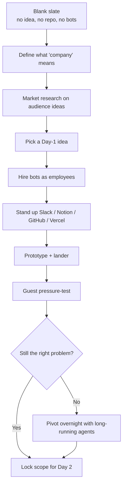
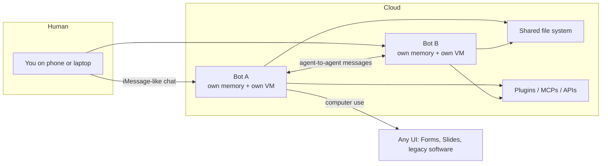
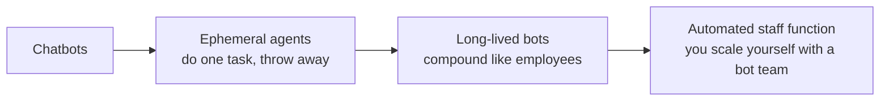
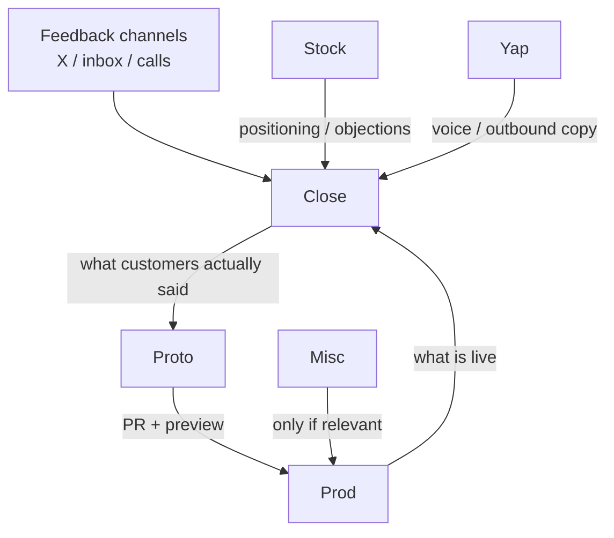
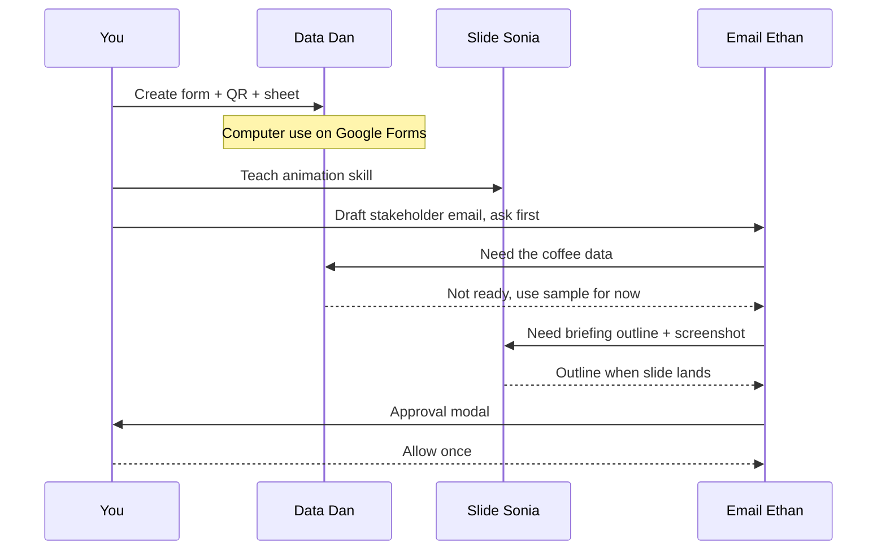

# Grok Bot Galaxy Livestream — Day 1 Detailed Notes

> **Event**: Grok Bot Galaxy live build (Dreamforce week, San Francisco, studio next to Moscone Center)  
> **Source livestream**: [x.com/i/broadcasts/1AxRnZbVpjaxl](https://x.com/i/broadcasts/1AxRnZbVpjaxl)  
> **Short link**: [luma.link/YDHcs5LMRo](https://luma.link/YDHcs5LMRo)  
> **Format**: ~8.5 hours of live company-building + workshops + guest interviews  
> **Core experiment**: Three xAI teammates start from a **blank slate** and try to go from nothing → a functioning company in **72 hours**, using Grok Bot as the operating system.  
> **These notes are grounded only in Day 1 of the named transcript.** Names, product claims, and examples below come from what was said on stream.

---

## 0. How to read these notes

Day 1 is two interleaved tracks:

| Track | What it is | Why it matters |
|---|---|---|
| **Live company** | Matt, Lauren, Roshan ideate, hire bots, set up Slack / GitHub / Vercel / Notion, and pivot the business idea in public | Shows zero-to-one *process*, including mess and reversals |
| **Workshops + guests** | Grok Bot 101, Grok Bot for engineers, Grok Bot for founders, plus operator interviews | Teaches the *product model* and repeatable workflows |

The useful mental model from the stream is not “chat with an LLM.” It is:

**Bots are long-lived teammates that own outcomes, have their own cloud computer, remember, and can talk to other bots.**

---

## 1. Who is on the core live-build team

| Person | Role on stream | Day-to-day (as they described it) | How they actually use Grok Bot |
|---|---|---|---|
| **Matt Palmer** | Host / DevEx | Developer experience / DevRel at xAI. Content, docs, live streams, some engineering. Handle referenced as **@MaddyP** | Bookmark-to-prototype bot: scans X bookmarks → finds a cool package → kicks off a **Cursor Cloud agent** → preview-deploys (Cloudflare mentioned) → morning message with a running demo |
| **Lauren** (“Potato” on X) | Engineer on Grok Bot | Performance, codebase so PMs/designers can contribute safely, personal automation | Infamous **P Stack** plugin; “summon me” bot that replies when people say `potato potato potato`; plans to merge to main instead of opening PRs during the 3-day build |
| **Roshan** | Product | Product on Grok Bot + connectors / marketplace; customer feedback → what to build next | Excited about zero-to-one: market research, interviews, coordinating designer/marketing/engineer bots |

Supporting workshop speakers on Day 1:

| Person | Session | One-line role |
|---|---|---|
| **Roman** | Grok Bot 101 — origin story | Product framing: teammates, not tasks |
| **Amrita** | Grok Bot 101 — live demo | Field / enterprise workflows: Data Dan, Slide Sonia, Email Ethan |
| **Peter Yang** | Mid-day guest | Solopreneur / PM advice on ideas vs. signal |
| **Cody** | Mid-day guest | Startup / founder instincts (distribution, early loops) |
| **Lingxi** | Grok Bot for engineers | xAI engineer; shipped Grok Bot mobile v1 in ~3 weeks using Grok Bot |
| **Kevin DeParco** | Product / colleague framing | “Results, not text”; finish the job |
| **Eric** | Later conversation | Pop-up / merch / physicality; “verifiable loops” |
| **Shub (Shoob)** | Grok Bot for founders | Founder operating system: Close / Prod / Stock / Proto / Yap bots |
| **Jenny** | Evening guest | VC + creator + new parent running **7 businesses** with **22 Grok Bots** and a chief of staff nicknamed **Master Chief** |

---

## 2. The 72-hour brief

### 2.1 What they announced

- Location: live studio in San Francisco during Dreamforce (~50,000 extra people in the city).
- Duration: three days / **72 hours**. Stream roughly **8:30 → 18:00–18:30** with cuts to workshops.
- Starting condition (they repeated this): **no idea chosen, no repos, no bots, no prior work.** Brand-new Grok Bot team + empty GitHub org.
- Constraint they accepted in public: there will be mistakes, silence, typing, messy tables, and pivots.

### 2.2 What “build a company” meant on Day 1

They explicitly rejected the internet debate of “startup vs. multi-billion-dollar company vs. side project.” Their working definition, assembled from the three hosts:

| Ingredient | Who pushed it | What it means on this stream |
|---|---|---|
| Something people want | Matt | Classic “build something people want.” Prefer something they would use themselves. |
| Dogfooding | Lauren | Best companies eat their own cooking. She uses Grok Bot to build Grok Bot. The 3-day company should have the same loop. |
| Money in a bank account | Lauren + Matt | “Not a real business until dollars flow.” Bots can now be given a **linked card / Stripe**. Humans *or* other bots could be customers. |
| Serve humans (or the humans behind agents) | Matt | Even if an agent buys, a person asked it to. Physical delivery, in-person experience, and “human touch” kept coming back. |
| Outcome ownership, not task lists | Roman / Kevin later | A company is a set of responsibilities, not a pile of tickets. |

### 2.3 GitHub org and starting stack

| Asset | Status at open | Notes from stream |
|---|---|---|
| GitHub org | Empty | `github.com/shipbythursday` — “Ship by Thursday” |
| Grok Bot team | New team, zero bots | Each host will run their own bot squads inside that team |
| Company handbook | Planned | Living doc of principles + process; bots should update company state |
| Open source | Possible | They floated putting Easter eggs / templates in the org so viewers can follow |

---

## 3. Grok Bot Galaxy live-stream challenge

Announced early and repeated at close.

| Item | Detail from stream |
|---|---|
| Prize | Trip to a **Starship launch at Starbase, Texas**, for winner **+ a guest** |
| Runners-up | Tour of the **SpaceX rocket factory in Hawthorne** (Bay Area) |
| Deadline mentioned | **September 29th** |
| How to enter | Follow **@Grok** and **@Bot** on X. Quote the official post with (1) a description of your bot and (2) a **share template link** |
| What they want | Proof you integrated Grok Bot into real work — not a toy prompt |

Schedule / follow-along: install Grok Bot (free trial mentioned), watch workshops, reuse plugins/templates they publish. Positioning: “this *is* the course — no paid course required.”

---

## 4. Tooling they chose in the first 30 minutes

They treated the 3-day company like three friends sitting down with laptops.

| Layer | Tool they leaned toward | Why / how bots plug in |
|---|---|---|
| Control plane / chat | **Slack** first | Issues channel. Lauren: “why open an issue when you can open a PR?” Wire a factory so a Slack bug report can become a fix. |
| Docs / company state | **Notion** | Handbook, research, briefs. Bots write here. |
| Tickets | **Linear** (optional) | Only if backlog appears. Default bias: ship. |
| Code | **Cursor** + Grok Bot + **P Stack** | Humans write in Cursor; Grok Bot handles the manual / orchestration work and can kick cloud agents. |
| Hosting | **Vercel** (connected mid-day) | Lander + app preview. Popup repo appeared after they connected it. |
| Payments | **Stripe / Link** | Needed if anything is sold. Bots can hold a card. |
| Identity of the company | Empty GitHub org **Ship by Thursday** | Completely blank on purpose. |
| Whiteboard | Physical board requested on stream | They later had things written on it; idea still not locked. |

Lauren’s operating preference: start with Slack, auto-fix from the issues channel, merge to main, track a **commit meter** on screen rather than a PR meter.

### 4.1 P Stack (Lauren)

P Stack is **not** a paid product. On stream she described it as:

- An **open-source plugin** on the Grok Bot marketplace.
- A packaged set of **skills and workflows** she uses for rigorous engineering.
- Something she iterated for a long time, then used at extreme volume.

**PR math she and Matt walked on stream:**

She said she shipped **2,500 PRs of P Stack into production in one month**, and hoped she caused no bugs.

Matt’s arithmetic, written out:

\[
\frac{2500 \text{ PRs}}{30 \text{ days}} \approx 83.33 \text{ PRs/day}
\]

\[
83 \text{ PRs/day} \times 3 \text{ days} \approx 249 \text{ PRs}
\]

She immediately raised the bar: she might skip PRs and **merge to main**. Matt renamed the joke metric from “PR meter” to **commit meter**.

Grounded takeaway from this bit: Grok Bot (the product) is itself built by people using these same loops. The livestream is meant to show that factory, not a sanitized demo.

---

## 5. Roman — How Grok Bot came to be (product philosophy)

This is the conceptual spine of the whole day.

### 5.1 Four phases of AI at work

| Phase | Interaction | What the human does | Limit |
|---|---|---|---|
| 1. Chat | Ask → answer | Research, Q&A | Stops at text |
| 2. Copilot | Sit beside you | Co-edit a deck, co-write code | Still a task helper |
| 3. Teammate *(now)* | Own a lane | You assign a job; it comes back later | Requires memory, computer, cloud |
| 4. Mixed org *(next)* | Human teammates + AI teammates | People and bots share outcomes | Still forming |

Roman’s distinction that they kept repeating:

- Old: “Go from point A to point B” (a task).
- New: “Own this part of the company” (an outcome + responsibility + trust).

### 5.2 Three product bets that shaped Grok Bot

| Bet | What it looks like | Why they did it |
|---|---|---|
| **Teammate UX, not task UX** | Chat-like, iMessage-shaped. Left rail is a roster of bots (Sales Outbound, Inbox Manager, …). You do **not** open a new chat per task. You return to the same bot. | Colleagues remember that you like slides formatted a certain way. Bots should too — weeks later. |
| **The bot has its own computer** | Isolated **Linux VM** per bot. Can click old government software, watch video, listen to podcasts, use Google Forms — even when there is **no MCP / API**. Integrations still exist; computer-use fills the last mile. | APIs get you ~90%. Computer-use is how work actually finishes. |
| **Everything runs in the cloud** | Not tethered to your laptop. Works while you sleep, from your phone, when the lid is closed. | Local-agent world is “weird”: 2 a.m. jobs die if the laptop is shut. |

### 5.3 Why they started from coding

Roman’s claim: software engineering already moved from “I type every line” → “I own direction and steer a team of agents.” Knowledge work has **not** made that jump yet. Grok Bot’s goal is to be the most useful way to put current models to work *inside a company*, not just inside an IDE.

Desired product feel:

- Delightfully simple to start.
- Gradually exposes power.
- Always on.
- You give **outcomes**; it delivers **finished work**.
- Next frontier: **shared AI colleagues** and what internal tooling becomes when teammates are not only human.

---

## 6. Amrita — Grok Bot 101 live demo

Workshop goal: show the three Roman properties in one end-to-end loop.

### 6.1 The three demo bots

| Bot | Job | Computer / tools | Memory / skills |
|---|---|---|---|
| **Data Dan** | Collect data | Creates a **Google Form** by driving Google in the VM; turns the form into a **QR code**; writes responses to a Sheet | Created from scratch on stage so viewers see onboarding |
| **Slide Sonia** | Slides + charts | Has the 101 deck open on her computer | Amrita **teaches a task** live (fly-in animation) → recording becomes a reusable **skill** |
| **Email Ethan** | Stakeholder email | Gmail / contacts; drafts in a modal | Learns tone from Amrita’s past real emails; can be told “always ask before sending” |

Live project they ran with the room + remote viewers:

1. Ask how many cups of coffee people drink per day.
2. Ask favorite SF coffee shop (Ritual, Fields, Sightglass, Blue Bottle).
3. Turn answers into charts on the 101 deck.
4. Email a stakeholder (“Jason”) a briefing.

### 6.2 Creating a bot from scratch

- Naming matters. Type “Data Dan” / “workflow builder” and Grok Bot **guesses the job** from the name and offers “what do you mainly want me for?”
- Voice mode: Amrita dictated the form spec. Internal build already had **back-and-forth Grok voice**; she said that should ship “hopefully within the next week or so.”
- Immediately after send, the bot starts working. Top-right control opens **the bot’s Linux VM** so you can watch it click through Google Forms.

### 6.3 Teach a task → skill

This is one of the most concrete mechanics of the day.

1. Open Slide Sonia’s computer.
2. Hit **Teach a task**.
3. *You* drive the bot’s computer (Insert → Animation → fly-in → preview).
4. Stop the task.
5. Grok Bot converts the recording into a **skill**.
6. Later you can say “add that animation to this text/image” and Sonia does it from scratch.

Same pattern works for any UI that does not have a clean API.

### 6.4 Approvals, auto-review, and enterprise control

Two layers:

| Layer | What it is | Example |
|---|---|---|
| **Auto-review classifier** | Built-in risk model. Decides if an action is safe enough to run or needs a human. | Creating a Google Form triggered many approval prompts on camera. |
| **Personal / org rules** | You write policies. They override or tighten auto-review. | “Never reply to email unless you ask me first.” “You may create slides without asking.” “Even `mkdir` on the desktop needs permission.” |

Amrita’s field-engineer framing: enterprises need **granular control** especially on long-running, external-facing work (email a customer, send Slack outside the company, move money).

### 6.5 Isolation, collaboration, routines

- **Computers are isolated.** Data Dan cannot see Slide Sonia’s VM. That is why two bots (or a human + a bot) can edit the same Google Slides file without fighting over one desktop.
- **Routines**: “Every morning at 9:00, summarize changes to this deck and who made them.” Routines can span bots: Sonia + Ethan email the boss a weekly change digest.
- **Delegation in the bot description**: a Chief of Staff bot can be told “you do not do work; you always delegate to the team.”
- **Explicit tagging**: “Message Slide Sonia and ask for a briefing on the Galaxy 101 deck.”
- **Group chat**: puts Ethan + Dan + Sonia in one thread so *you* can watch orchestration without clicking each DM. Tradeoff (Shub later): group chats are chatty and expensive.
- **Manager / orchestrator bot**: Amrita created a live **Manager** whose job is “get updates from Ethan, Sonia, and Dan; every 2 hours ask if anyone is blocked.” Same social protocol as a human standup.

Agent-to-agent protocol on stage looked like:

- Ethan: “Amrita asked me for coffee data.”
- Dan: “I do not have the live sheet yet; still building the form.”
- Ethan: “I will use my sample coffee dataset and wait.”
- Sonia: “I will scan the deck and pass Ethan an outline.”
- Ethan: “Holding the email until Sonia’s screenshot lands.”

They already understand **dependencies**. Amrita analogized this to avoiding git merge conflicts in engineering.

### 6.6 Sharing, marketplace, duplication

- **Share as template** → teammates clone and customize.
- Marketplace featured public bots (Lauren / P Stack, Clairevo, Lenny, Eric, etc.).
- Duplicate an agent when stakeholders differ: one email bot for CTOs/CFOs, one for end users, one for the internal team. Same job family, different tone and memory.
- Sections / folders in the sidebar: Unassigned vs Engineering vs this workshop. Group chats can be filed the same way.

### 6.7 Debugging with Grok Bot (QR code broke on stage)

The public form / QR failed (`request does not exist` / no access). Amrita treated it as the lesson:

- Tell the bot **the outcome** (“people cannot scan; make this link public”), not just “it’s broken.”
- Give details + **validate** when it troubleshoots correctly. She said this is how she works with customers as a field engineer.
- The bot inferred sharing settings, went to fix them, and fetched a responder link.

General debugging rule from this segment:

> Start from the finished artifact you want. Work backwards. If you only say “this isn’t working,” the bot cannot learn from the miss.

### 6.8 Memory

Steering is not ephemeral. When you say “never use my first and last name, only my first name,” that is stored (she mentioned **S3** as the backing store) and reused for the life of the bot.

---

## 7. Day 1 company-building: what they actually did

### 7.1 Morning intent

- Crowd-source ideas (they had already asked viewers + SpaceX employees; “thousands of responses”).
- Ask Grok Bot to cluster that research.
- Hire a first wave of bots (founding engineer, intern, research, designer, marketing).
- Meta-idea: a **bot factory / onboarding bot** that reads the company handbook and spins up new employee-bots with the right principles.

Lauren also wanted a **prototype machine**: throwaway UIs so they can *see* ideas, similar to Matt’s daily bookmark-to-demo bot.

### 7.2 Idea gravity on Day 1

They did **not** lock a company. The center of mass moved toward something **physical + local + human**, because they were in SF during Dreamforce and kept saying software-only felt too thin.

Ideas and artifacts that showed up on stream:

| Artifact / idea | What happened |
|---|---|
| Market-research bot on the crowd responses | Planned as first real work after 101 |
| Restaurant-tour brief / local experience | Matt spun **Dr. Egg bot** at a research spike |
| Domain riffing | `peanutpopup.com`, `poppeto.com`, `hostapopup.com` |
| **Popup / pop-up event** | Became the leading candidate: in-person gathering, merch, local businesses, maybe a virtual layer for remote viewers |
| Lander | V1 lander on Vercel after the popup repo existed |
| Company doc | Matt sent a draft to Roshan; bots writing into Notion |
| Slack + Cursor bot + Vercel | Wired mid-afternoon |
| Engineering bots | Lauren’s **Tater** (engineering) and **Hashbrown** (companion naming) |
| Marketing bot | Roshan kicked one off to draft a plan from transcripts |

### 7.3 Peter Yang — idea advice while they were still wandering

Peter’s points, grounded in the transcript:

- Design the business around **work you actually enjoy**. Solopreneurs who optimize only for money end up doing jobs they hate, which defeats the point.
- Ideas are cheap. **Team** (here: human + bot team) is the scarce thing. Do not get too married to an idea.
- Get **market signal fast**. Old PM life = internal debate + docs → ship → nobody wanted it.
- “Would you pay?” is weaker than **watching someone actually pay**. People will be polite.
- Implication for the 72-hour build: stop polishing the idea memo; put something in front of humans.

### 7.4 Infra they had standing by late afternoon (Matt’s recap)

- Slack spun up
- Bots writing to Notion
- GitHub org + repo
- Vercel connected
- V1 lander iterated
- Whiteboard in the room with fragments, not a locked plan

Honest end-of-day self-assessment from Roshan: **idea generation is hard**; they spent a lot of Day 1 in breadth, not lock-in. “A lot of wisdom in the crowd” from guests. Overnight job = force clarity onto one or two things they can actually finish.

---

## 8. Lingxi — Grok Bot for engineers

### 8.1 Who and why listen

Lingxi: software engineer at xAI (previously Cursor). Shipped two products in ~9 months, including the **Cursor 3 agent window**. For the last ~2 months he used **only Grok Bot** for engineering work and built the **first version of the Grok Bot mobile app by himself in 3 weeks**.

### 8.2 His history of coding assistance (how we got here)

| Era | Capability | What changed |
|---|---|---|
| Pre-2024 | Syntax completion | Local, dumb |
| Tab completion | Predict the next edit | First real leap |
| Ask + Edit | Agent can read the repo and do repetitive edits | Still short-horizon |
| Agent encoding (Cursor 2 / 3) | Agents drive computer, mouse, keyboard; test end-to-end; plan; `/goal` and `/loop` so you do not nudge | Long-horizon ownership |
| Grok Bot era (his last 2 months) | Same agency, but as a cloud teammate you can point at *any* surface, not only the IDE | He could cover more of the product and try first-principles approaches they had skipped |

Workshop thesis: engineering is no longer “I implement the ticket.” It is “I own the outcome and steer bots / cloud agents until the thing is in users’ hands.”

That is the same sentence Roman used for knowledge work. Lingxi is the existence proof on the engineering side.

---

## 9. Kevin DeParco — colleague properties

Kevin + Roshan compressed the product into a checklist of **best colleagues you have actually worked with**:

| Human colleague trait | Grok Bot translation |
|---|---|
| Huge context about the org | Memory + files + shared company docs |
| Learns on the job | Skills, steering, compounding over weeks |
| Moves independently | Cloud VM; does not sit waiting on you |
| Makes decisions | Comes back when it needs approval, not for every keystroke |
| You text them | iMessage-like surface |
| They return **results**, not essays | Finished form, finished deck, finished email, finished PR |

Kevin’s two slide takeaways:

1. Give Grok Bots **real work**.
2. They should **finish jobs**.

Roshan’s one-liner: *an agent with a computer that feels like texting a colleague.*

---

## 10. Shub — Grok Bot for founders (the operating-system talk)

This was the most complete “how to run a company on bots” playbook of Day 1.

### 10.1 AI maturity curve (as he drew it)

Key word: **compound**. Do not throw the agent away. Invest in it the way you would invest in a hire.

### 10.2 What founders must protect

| Founder job | How bots help on his telling |
|---|---|
| **Focus** | Absorb the necessary-but-not-important firehose |
| **Velocity** | End-to-end tasks + routines + cloud agents so shipping does not wait on you |
| **Quality of insight** | Triage X / email / product data so decisions stay good when information volume explodes |

Prompting rule he repeated: tell the bot to do the **whole job including verification**, not a slice.

Also: “do things that don’t scale” is now scalable. The janky concierge onboarding that won the first 10 customers can be a bot loop instead of founder hours.

### 10.3 His four working bots (+ guests)

| Bot | Job family | Concrete loop from the demo |
|---|---|---|
| **Close bot** | Customers, end-to-end | Before call: deep research + product telemetry + walk the customer’s site + write a private prep HTML (screenshots, usage graph, risks, talking points). After call: read **Granola** transcript, learn what resonated, stop pitching dead features. Support: connected to data **and billing** (the scary parts). Activation: on a wow-event (example: shared a template with teammates) auto-send credits / email. Also: contracts, pipeline, calendar fill. Runs off calendar routines so prep exists 5 minutes before the meeting. |
| **Prod bot** | What shipped / unshipped | Reads PRs + Linear, **walks the live product on its own computer**, screenshots + optional video, maps UI changes to “decisions we may have made by accident,” overlays metrics. Built to stop the “I demoed a button we unshipped this morning” failure. Demo surface: **Flylow** (flights / travel). |
| **Stock bot** | Competitors | Finds competitors, **signs up with a throwaway email**, records onboarding video, writes HTML teardown, watches changelog + X + hiring (hiring is a product signal). Optional: email churned customers who left for a named competitor and ask why. Demo targets: **Notion** and **Craft**. He offered to publish this bot via QR. |
| **Proto bot** | Feedback → prototype → PR | Has **its own Grok Bot account** on its computer so it can drive the product it is building. Pulls latest feedback, explores UI, kicks a **cloud agent**, QAs the result. Founder still chooses *which* feedback to take; the bot removes the implementation bottleneck. |
| **Yap bot** | Talk like Shub | Trained on his email, Slack, iMessage. Retrains on a schedule from new outbound. Other bots pull Yap bot in when they need to sound like him. Sensitive mail stays in drafts; the delta between draft and sent becomes training data. |
| **Misc bot** | Trash can | Random questions (example: “did Drake’s album drop?”) so specialist bots do not get their context polluted. Can be told to hand a learning over to Prod bot if it matters. |

Emotional note he was honest about: some customer conversations are *fun*. He sometimes **steals work back** from Close bot on purpose. The point of the system is not to never talk to humans. It is to spend human time only where it changes the company.

### 10.4 Founder setup framework (Q&A)

Question: how do you spend the 1–2 hours creating jobs for bots?

His method:

1. Inventory everything you actually do.
2. Cluster by **expertise**, not by random prompt.
3. Give each bot a domain (customers, finance, marketing, product pulse).
4. Let scope expand later; start narrow.
5. Chief-of-staff-on-top is a **personal preference**. He is not a fan (too much abstraction). Jenny, later, is a fan. Both are valid.

Other Q&A grounded answers:

| Question | His answer |
|---|---|
| Deterministic enterprise policy | Models are not deterministic. Workaround: make the bot **write code / a flowchart** and call that function every time. Code is the deterministic layer. Bots can also be told to ask another bot for permission. |
| Import an existing local setup | Being built. Meanwhile: one source of truth for MCPs, **1Password**, import **browser cookies** so the VM stays signed in. |
| UI vs paid APIs on legacy systems | Bias headless / DOM commands; computer-use will get faster but “faster than a first-party API” is a hard promise. Ask the bot to watch **network requests** once, then hit the discovered API directly (cheaper than repeating browser-use). |
| Token blow-ups in multi-bot | Group chats make bots talk over each other. Prefer **point-to-point tagging**. You can tell a bot to **forget** a topic. Specify models when kicking Cursor / Grok Build cloud agents. |
| Marketplace quality | Internal marketplace is **hand-audited** (humans + bots reviewing bots). Ask a template “what do you do and how?” before running it. |
| Cross-account bot-to-bot | Not shipped yet; they want the form factor. |
| Local vs bot computer | Settings → allow local execution if you must. They bias to the bot VM because local pops windows on your screen and eats your CPU. |
| Shared memory? | **Not the same context window.** Same **file system** (one VM, multiple desktops). Bots can read each other’s files when the task needs it. |
| Cursor Cloud agents vs Grok Bot | First-class handoff: Grok Bot passes *relevant* context, agent ships independently, Grok Bot QAs the PR. Use cloud agents when you want model control and a heavyweight code change. |

### 10.5 Power-user tips he closed on

1. **Let bots run free** — give as much access as you can tolerate, or they cannot finish jobs.
2. **Invest, do not reset.** Course-correcting a long-lived bot is the point. Context pollution is a reason to *teach*, not to throw the employee away.
3. Write **real skills**, not “make this cooler.”
4. Block **1–2 hours** to decide what to delegate. Random bots without intent waste tokens.
5. Browser-use is powerful and **expensive**. Prefer APIs; or sniff network once.
6. **Audit routines.** People set 15-minute routines (~100 runs/day). Prefer webhooks / inbound signals over blind cron.
7. Make a **voice bot**. Import cookies. Group bots by expertise.
8. Keep an **optimizer bot** whose only job is to improve the other bots’ routines and failure patterns.

---

## 11. Jenny — 22 bots, 7 businesses, one baby

Jenny joined late Day 1 with a newborn on camera (“first Grok baby”). Background she gave: VC, community of women building with AI, media across platforms, and a new agency **Gemini Media** (executive brands).

### 11.1 How her org is shaped

- **7 businesses** (real estate / rentals, VC fund, media, agency, …).
- **22 Grok Bot employees**.
- **Master Chief** — chief of staff (husband named it). Shub does not like this pattern; she does. Master Chief oversees tenants/guests, agency work, inbound brand partnerships — “running Jenny Co.”
- Specialist examples:
  - **Boxy** — inbox monitor
  - **Scribe** — every Whisper Flow / meeting note → delegates to sub-agents
  - **CFO cluster** — bookkeeping, receipts while she is out
- She uses the group-conversation pattern Shub warned about, on purpose: Master Chief pulls specialists into a project thread.

Claim she made: she can run this portfolio *and* raise a baby because the bots hold the operational floor.

### 11.2 She pressure-tested their pop-up idea (event-producer lens)

They were behind: venue list existed, **zero outreach**, logistics unsolved. Jenny ran them through a real production checklist:

| Decision | Why a bot cannot skip it |
|---|---|
| Date / month | SF venues book out; permits take time |
| Evening vs 9–5 | Many rooms close at night |
| Alcohol? | They said **no** to cut permit surface |
| Food? | Yes, **served hot**, not only grab-and-go |
| On-site kitchen vs catering | Catering means **preferred-vendor lists** at SF venues |
| Capacity | ~100, maybe 200; warehouse / gallery feel |
| AV | At least mic + speakers so they can teach the launch |
| Staffing | Bots will not badge guests or do security |
| Marketing budget in or out of the event budget? | They parked marketing as a separate line to simplify |

Prompt they started writing live (shape, not a magic spell):

> You are a senior event planner in the City of San Francisco. Create a production budget for a **pop-up event** for 100–200 guests. Include venue, food and beverage, staffing, and basic AV (mics to address the audience). Ignore company-level marketing for now.

Then that bot should emit RFPs only to venues that already match.

### 11.3 Three bots she told them to create before Day 2

| Bot | Job | Overnight behavior |
|---|---|---|
| **Event planner / budget bot** | First production budget + vendor constraints | Draft numbers humans can argue with in the morning |
| **Scout** | Venue search against a tight criteria sheet | Identify candidates + **draft outreach emails**, do not send |
| **Permit / red-tape bot** | SF / California policy research for *this* event | Flag legal requirements; first-pass contract read |

Legal caveat she relayed from attorney friends: treat the model like a **second-year law student**. It can read the statute. It does **not** know “the going rate in this city and this industry.” A human with reps still reviews.

Other Jenny tactics they could steal:

- Negotiation bot: she already has a bot reselling clothes across **Poshmark / Depop / Mercari** and bidding with a written framework + budget ceiling.
- Audience bot: log into Meta / Instagram, pull **50 local followers with the highest follower counts**, pre-draft invites so the room has distributors, not only attendees.
- Same pattern on X, which they already have in volume from the livestream.

Her meta-method for building an agency on a lean budget:

> Do the work as a human first. Write down what a good human would do. **Reverse-engineer that into bots.** Do not start from “what can the model do.”

---

## 12. Eric’s cut — physicality and verifiable loops

Eric (in the late-day merch / ticket conversation) pushed a principle that also showed up in his creator advice:

- The pop-up is special **because it is not only software**. Tickets, plushies, hoodies, and the room are part of the product.
- Look at your workflow and find loops that are **verifiable**. Coding is the obvious one: tests fail or pass. A creator version: research brands → outreach → negotiate rates → content ideas. Give Grok Bot the loops you can inspect.
- If you cannot tell whether the bot succeeded, do not let it run unsupervised.

That pairs cleanly with Shub’s “end-to-end including verification” and Lauren’s “merge to main only if you trust the factory.”

---

## 13. Grok Bot capability map (Day 1 vocabulary)

Use this as a glossary. Every term below was used on stream with a concrete example.

| Term | Meaning on this product | Day 1 example |
|---|---|---|
| Bot | Long-lived teammate with a job, memory, computer | Slide Sonia, Close bot, Tater, Master Chief |
| Computer / VM | Isolated Linux desktop the bot drives | Data Dan filling Google Forms |
| Plugin / MCP | First-class API integration | Drive, Gmail, Linear, Stripe, Cursor, 1Password |
| Computer use | Click any UI when no API exists | Qualtrics, old software, competitor sign-up |
| Skill | Reusable procedure, often taught by demonstration | Fly-in animation on slides |
| Routine | Schedule or signal that wakes a bot | 9 a.m. deck-diff; calendar-driven call prep |
| Auto-review | Risk classifier before an action | Form creation / email send prompts |
| Rule | Your written policy on top of auto-review | “Ask before any external email” |
| Template | Shareable bot config | Marketplace + contest entries |
| Group chat | Multi-bot room you can observe | Dan + Sonia + Ethan |
| Orchestrator | Bot that only delegates / unblocks | Amrita’s Manager; Jenny’s Master Chief |
| Cloud agent | Cursor / Grok Build coding agent kicked from a bot | Matt’s bookmark demo; Proto bot PRs |
| Teach a task | You drive the VM; bot records a skill | Sonia animation |
| Compounding | Memory + eval of past work makes the next job better | Close bot dropping dead talking points |
| Activation loop | Detect wow-moment → reward / nudge | Auto credits when a template is shared |

---

## 14. Playbooks you can copy from Day 1

### 14.1 Knowledge-work loop (Amrita)

### 14.2 Founder loop (Shub)

1. Inventory the week.
2. Split into customer / product / competitors / build / voice / junk.
3. Give each bot data + the risky systems (billing, calendar, production).
4. Write routines on **signals**, not 15-minute crons.
5. After every human correction, store the delta as a skill.
6. Once a week, run an optimizer bot over “where did I have to repeat myself.”

### 14.3 Event / IRL loop (Jenny)

1. Human writes venue criteria (capacity, hours, food, AV, no alcohol, city).
2. Budget bot produces a senior-planner budget.
3. Scout bot finds rooms that match and drafts RFPs.
4. Permit bot lists what SF will actually require.
5. Humans send the emails and sign.
6. Invite bot builds a list from X + Instagram and drafts outreach.
7. Keep a human on registration and security.

### 14.4 Engineering loop (Lauren + Lingxi + Matt)

1. Slack issues channel is the inbox.
2. Engineering bot (Tater) + P Stack skills pick it up.
3. Hard code changes go to a Cursor cloud agent with an explicit model.
4. Grok Bot QAs on its own computer (it can run the product).
5. Bias to preview deploys (Vercel / Cloudflare) so a human sees pixels, not diffs.
6. Memory of “how we structure this repo so PMs can contribute” lives in the bot, not only in heads.

---

## 15. Risks and limits they admitted on camera

Grounded list — these are *their* caveats, not outside commentary.

| Risk | Who said it | Mitigation they used |
|---|---|---|
| Bots do risky external actions | Amrita / audience Q | Auto-review + explicit rules + approval modals |
| Group chats burn tokens and talk over each other | Shub | Point-to-point tags; keep group chats for visibility of one hard project |
| Browser-use is slow and costly | Shub | Sniff APIs, go headless, do it once |
| Routines over-fired | Shub | Audit frequency; webhooks over cron |
| Models are not deterministic | Shub | Encode policy in code / flowcharts the bot must call |
| Legal / permits | Jenny | Bot = 2L review only; experienced human after |
| Idea fog | Roshan at wrap | Overnight long-running agents + force a lock on Day 2 |
| Pop-up in SF is operationally heavy | Roshan after Jenny | They openly asked “is this even the right problem?” |
| Auth / cookies / vendor lockouts | Shub Q&A | 1Password, cookie import, less prescriptive tool choice |
| Local execution steals your machine | Shub | Prefer the cloud VM |
| Cross-person bot communication | Shub | Not available yet |
| You will want to keep the fun work | Shub | Consciously steal some tasks back |

---

## 16. End of Day 1 — state of the company

What was **true** when they signed off around 17:30:

- They had an audience (~80,000 mentioned early), a contest, and a public empty org.
- They had Slack, Notion, GitHub, Vercel, a V1 lander, named engineering bots (Tater / Hashbrown), a marketing bot in flight, and a draft company doc.
- Leading product idea: a **pop-up** that connects people to local businesses / an in-person room, with a possible remote layer — still **not locked**.
- Jenny left them with three overnight workers: budget, scout (draft-only outreach), permit.
- Roshan’s open question: after hearing how hard a real SF event is, **is pop-up the right problem for 48 remaining hours?**
- Matt’s open question: can they turn something digital into something the viewers can touch in the real world?

Day 2 job, in their own words: **stop broadening, lock one or two things, let the overnight agents come back with artifacts humans can accept or kill.**

---

## 17. Resources mentioned on stream

| Resource | Where / what |
|---|---|
| Livestream | x.com/i/broadcasts/1AxRnZbVpjaxl |
| Challenge details | Posts on **@Grok** and **@Bot**; enter by quoting with template link |
| Sessions hub | x.ai/galaxy (Amrita: register for GTM / engineering / marketing / admin sessions) |
| Marketplace | Search **P Stack**; featured templates from Lauren and others |
| Follow-along org | github.com/shipbythursday (empty at open) |
| Matt’s bookmark→demo walkthrough | His X profile (@MaddyP referenced) |
| Install | Grok Bot app, free trial mentioned so viewers can mirror the build |

---

## 18. One-page cheat sheet

**Grok Bot in one sentence (Day 1):** a cloud teammate with memory and a computer that you text like a colleague, that finishes jobs, and that can hire / message other teammates.

**Do this if you are copying the livestream:**

1. Create bots by **role**, not by task.
2. Give each one a computer, the plugins it needs, and written approval rules.
3. Teach skills by driving the VM once.
4. Connect bots with explicit delegation or a chief of staff — pick one style and stick to it.
5. Put finished work (preview URL, screenshot, draft email, budget table) in front of a human every cycle.
6. Compound on the same bots for weeks.
7. Spend human time on taste, customers, and irreversible decisions (money, legal, “is this the company”).

That is the entire Day 1 argument, from Roman’s philosophy through Jenny’s permit bot.
